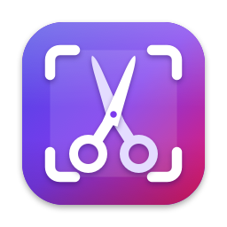
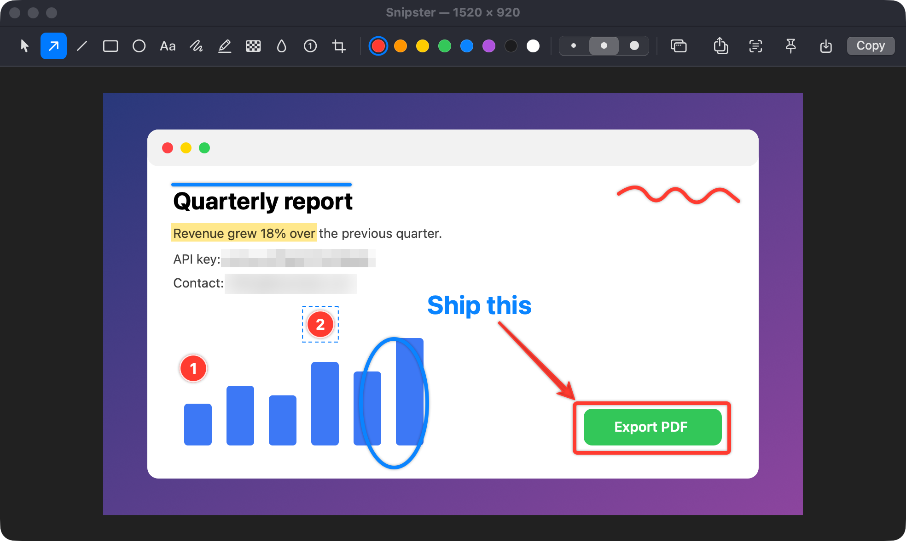
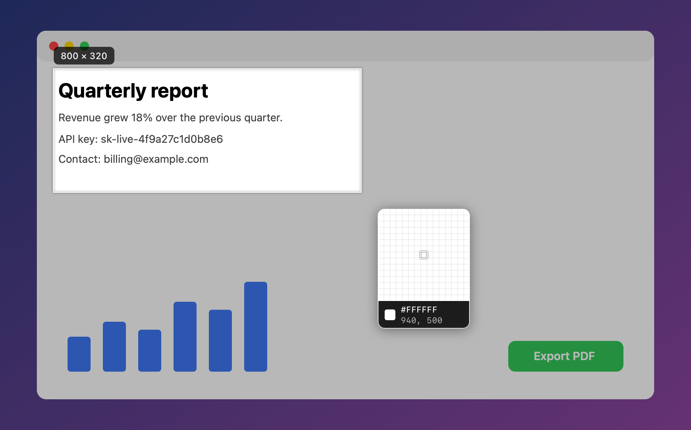
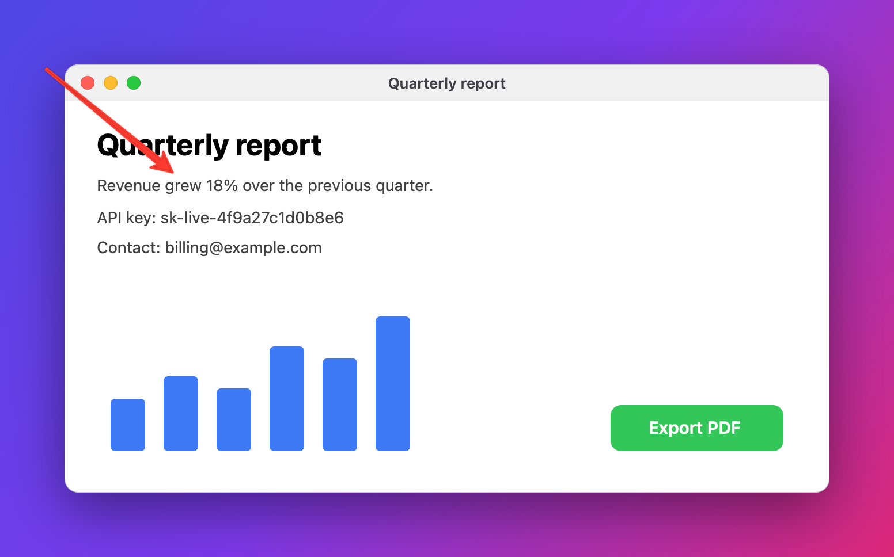
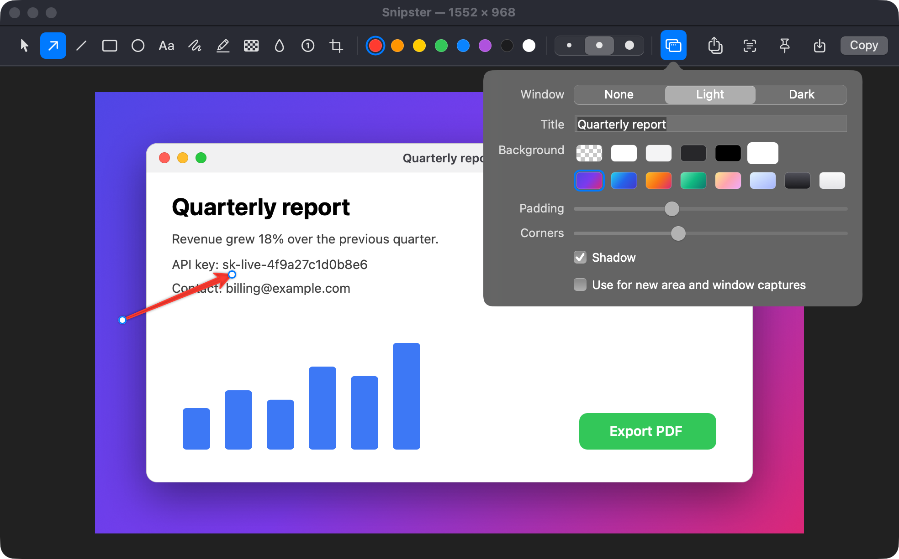
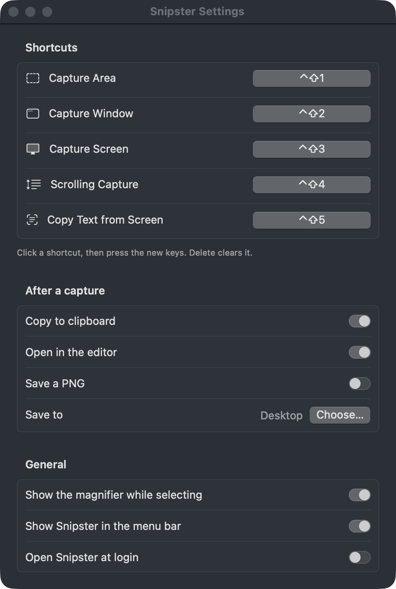

<p align="center">
  
</p>

<h1 align="center">Snipster</h1>

<p align="center">
  Fast screenshots for macOS: capture, mark up, share.
</p>



Press a shortcut and the screen freezes. Drag over the part you want, and it
is on your clipboard and open in an editor, where you can point at things, hide
things, put the picture in a tidy window frame and send it on.

Snipster is free and open source, makes no network connections, and keeps
everything on your Mac. Inspired by [Shottr](https://shottr.cc). Native Swift
shell, Rust core.

## Install

```sh
brew install --cask baboons/tap/snipster
```

You need macOS 14 or later on Apple Silicon.

<details>
<summary>Without Homebrew</summary>

Download `Snipster-aarch64-apple-darwin.zip` from the
[latest release](https://github.com/baboons/snipster/releases/latest), unzip it
and move Snipster.app to /Applications. Snipster is signed but not notarized,
so clear the download quarantine once before opening it:

```sh
xattr -dr com.apple.quarantine /Applications/Snipster.app
```
</details>

The first time you open Snipster, macOS asks whether it may record the screen.
A screenshot tool can't work without that, so say yes (System Settings →
Privacy & Security → Screen & System Audio Recording), then open Snipster
again. From then on it sits in the menu bar as a pair of scissors.

## Using it

### Take a screenshot

| Press | To |
|---|---|
| <kbd>⌃</kbd><kbd>⇧</kbd><kbd>1</kbd> | **Capture an area.** Drag a rectangle. |
| <kbd>⌃</kbd><kbd>⇧</kbd><kbd>2</kbd> | **Capture a window.** Point at it and click. You get the window by itself, rounded corners and all, even if something was covering it. |
| <kbd>⌃</kbd><kbd>⇧</kbd><kbd>3</kbd> | **Capture the screen** the pointer is on. |
| <kbd>⌃</kbd><kbd>⇧</kbd><kbd>4</kbd> | **Capture something long.** Pick an area, scroll down through the content, press Return. Snipster stitches it into one tall picture. |
| <kbd>⌃</kbd><kbd>⇧</kbd><kbd>5</kbd> | **Copy text.** Drag over anything on screen and its text is on your clipboard. QR codes work too. |

Everything is also in the scissors menu, and you can change the shortcuts in
Settings.



While you are selecting, a magnifier shows the exact pixels under the pointer,
their colour and position. A few keys help:

- **Space** switches between dragging an area and picking a window. Held
  during a drag, it moves the rectangle instead.
- **Arrow keys** nudge the pointer one pixel at a time (ten with Shift).
- **C** copies the colour under the pointer, as `#RRGGBB`.
- **Esc** cancels.

### Mark it up

The screenshot is copied to the clipboard right away, so if all you wanted was
the picture, you are done. It also opens in the editor:

| Key | Tool | Key | Tool |
|---|---|---|---|
| <kbd>A</kbd> | Arrow | <kbd>H</kbd> | Highlighter |
| <kbd>L</kbd> | Line | <kbd>X</kbd> | Pixelate |
| <kbd>R</kbd> | Rectangle | <kbd>B</kbd> | Blur |
| <kbd>O</kbd> | Ellipse | <kbd>N</kbd> | Step numbers |
| <kbd>T</kbd> | Text | <kbd>C</kbd> | Crop |
| <kbd>P</kbd> | Pen | <kbd>V</kbd> | Select and move |

Pick a colour and a stroke size from the toolbar. Hold Shift to keep lines
straight and boxes square. Anything you draw can be moved, recoloured or
deleted afterwards, shapes can be reshaped by their handles, and ⌘Z undoes
everything, including a crop.

When it looks right:

- **Return** copies the result and closes the window. That is the fast path.
- **⌘C** copies and keeps the editor open. **⌘S** saves a PNG.
- **Drag the share icon** into Slack, Mail or a folder to drop the picture there.
- **Pin** (⌘P) floats the picture above all your other windows, handy for
  keeping a reference in view. Drag it around, scroll to resize it, Esc to dismiss.
- **The text button** copies the words in the screenshot.

Pinch or ⌘-scroll to zoom. Zoomed in, you see the real pixels.

### Give it a frame and a background



A bare crop of an app can look lost in a document or a chat. The window button
in the toolbar dresses it up:



- **Window** wraps the picture in a macOS window, light or dark, with a title
  if you want one.
- **Background** can be transparent, a solid colour (pick any), a gradient, or
  your desktop picture.
- **Padding**, **Corners** and **Shadow** set how much room it gets, how round
  it is, and whether it casts a shadow.

You see every change as you make it, and arrows can run from the background
onto the picture. If you want all your screenshots like this, tick **Use for
new area and window captures**.

A captured window keeps its rounded corners, so on a transparent background
the corners are see-through rather than filled with whatever was behind them.

### Settings

<p align="center">
  
</p>

- **Shortcuts:** click one and press the new keys.
- **After a capture:** copy it, open it in the editor, save it to a folder, or
  any mix of the three.
- **Show Snipster in the menu bar:** turn it off for a cleaner menu bar. The
  shortcuts keep working, and opening Snipster again brings the settings back.
- **Open Snipster at login.**

### From scripts and other apps

`open snipster://capture/area` starts a capture, as do `window`, `fullscreen`,
`scrolling` and `recognizeText` in place of `area`. That makes Snipster easy
to trigger from Raycast, Alfred or a shell script. Image files opened with
Snipster go straight to the editor.

## Why it feels fast

Measured on an M5 Pro with a 5K and a 1440p display (`make bench` prints the
same numbers for your Mac):

| | |
|---|---|
| Shortcut to frozen screen | about 30 ms |
| Crop 1600×1000 and encode it as PNG | about 3 ms |
| Encode a whole 5120×2880 display as PNG | about 9 ms |

- **Nothing is set up when you press the shortcut.** The slow parts of taking a
  screenshot (asking macOS what is on screen, building full-screen windows)
  are done when Snipster starts.
- **The display you are looking at comes first.** macOS answers screenshot
  requests one at a time, so Snipster asks for the display under the pointer
  alone and freezes the others a few milliseconds later.
- **Pixels aren't copied until you have chosen them.** The frozen screen is
  shown straight from the buffer macOS delivered it in.
- **PNG encoding uses every core.** Normally a PNG is compressed on one thread.
  The Rust core cuts the image into bands, compresses them in parallel and
  joins them into one valid file: about 15× faster than the standard encoder
  at the same file size.

## Building

Requirements: macOS 14 or later, a Swift 6 toolchain (the Xcode Command Line
Tools are enough; Xcode itself is not needed) and [Rust](https://rustup.rs).

```sh
make app          # build/Snipster.app
make run          # build and open it
make install      # build, copy to /Applications and open it
make test         # the core's tests, then the editor driven through its real mouse and keyboard handlers
make bench        # time each stage of a capture
make zip          # the release archive
make screenshots  # redraw the images in docs/ from made-up content
```

### Keeping Screen Recording access across rebuilds

macOS ties the Screen Recording grant to the app's code signature. `make`
signs with the first code signing certificate in your keychain, so the grant
survives rebuilds. Without one it signs ad hoc, and you have to grant access
again after every build (if the old entry lingers, clear it with
`tccutil reset ScreenCapture com.baboons.snipster`).

Any certificate works, including a self-signed one:

```sh
security find-identity -v -p codesigning
make install SIGN_IDENTITY="Name Of Certificate"
```

### Releasing

```sh
scripts/release.sh 0.2.0
```

This bumps the version, commits, tags `v0.2.0` and pushes. The Release workflow
then builds, signs and publishes `Snipster-aarch64-apple-darwin.zip`, and the
Homebrew cask in [baboons/homebrew-tap](https://github.com/baboons/homebrew-tap)
is bumped automatically.

Releases are signed with a dedicated self-signed "Snipster Release"
certificate, stored in the `SNIPSTER_SIGNING_P12` and
`SNIPSTER_SIGNING_PASSWORD` repository secrets. It must never change: macOS
ties the Screen Recording permission to it, so a release signed with anything
else makes every user grant access again.

## How it works

Snipster is a Rust core with a Swift shell.

```
core/                  Rust: the pixel work
  src/png.rs           the parallel PNG encoder
  src/effects.rs       pixelate and blur
  src/stitch.rs        joins the frames of a scrolling capture
  include/             the C header Swift imports
Sources/Snipster/      Swift
  Core/                capture (ScreenCaptureKit), bitmaps, shortcuts, settings, text recognition
  Capture/             the selection overlay, the capture flow, scrolling capture
  Editor/              canvas, annotations, window frames and backgrounds, toolbar
  UI/                  pin windows, settings, toasts, the menu bar icon
  Debug/               benchmark and snapshot harness
Resources/             Info.plist
scripts/               the icon drawing and release.sh
```

Everything that crosses between the two languages is a plain BGRA pixel
buffer, which is what ScreenCaptureKit and CoreGraphics produce, so nothing is
converted on the way.

The scrolling stitcher works out how far the content moved between two frames
by comparing a coarse signature of each row rather than exact pixels. Two
captures of the same content differ by a grey level here and there, and an
exact comparison rejects every real frame. Rows that never move, like a sticky
header, are detected and kept once.

### Development notes

- Running `build/Snipster.app/Contents/MacOS/Snipster` from a terminal inherits
  the terminal's Screen Recording access, which is handy while developing.
- `Snipster --demo-snapshot <scene> out.png` drives parts of the real UI with
  synthetic input and writes a picture of the result. `selfcheck` and `render`
  need no permissions; the scenes are listed in
  `Sources/Snipster/Debug/DemoSnapshot.swift`.
- `Snipster --capture area` starts a capture right after launch.
- `@State` is a macro whose plugin ships only with Xcode, so the SwiftUI
  settings view keeps its state in a plain `ObservableObject`.
- `make` builds for the Mac's own architecture only.

## Not there yet

Compared with Shottr: no ruler or measuring tools, no spotlight or erase
tools, no uploads, no JPEG export and no capture history. Scrolling capture
follows your scrolling; it doesn't scroll for you.

## License

[MIT](LICENSE)
